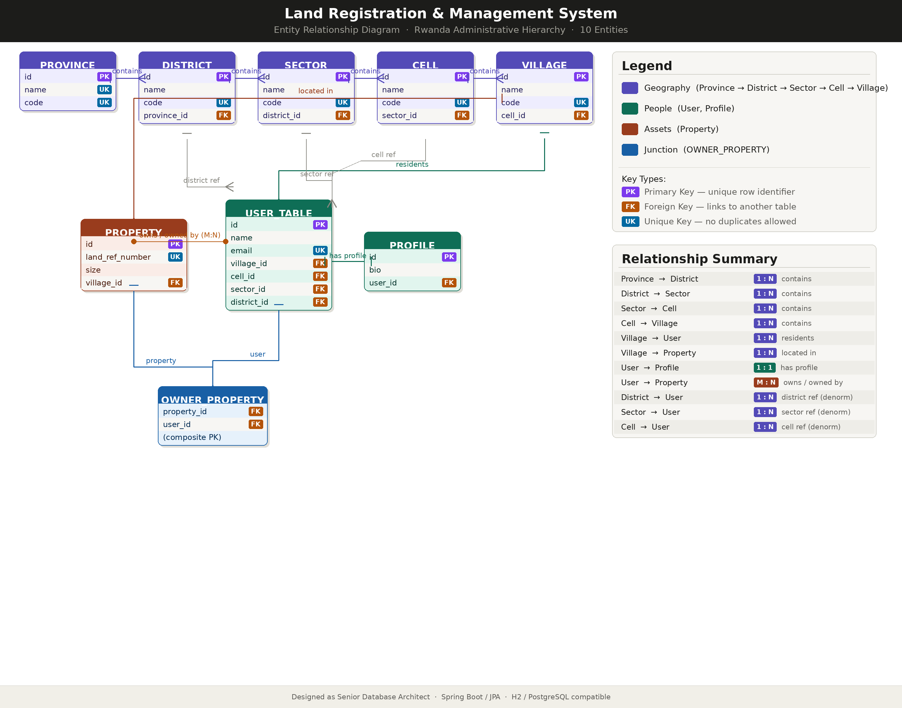

# 📸 ERD Image Display Information

## ✅ Changes Made

### 1. Cleaned Up README
Removed the following sections:
- ❌ Additional Documentation section
- ❌ Project Achievements section  
- ❌ Author contact details section
- ❌ License section
- ❌ Acknowledgments section
- ❌ Duplicate content

### 2. Fixed ERD Image Path

**Old Path** (only works locally):
```markdown

```

**New Path** (works on GitHub):
```markdown

```

## 🖼️ Why the Image Wasn't Showing

The relative path `docs/erd-diagram.png` only works when viewing the README locally or in some editors. On GitHub, you need to use the full raw URL to display images properly.

## 🔍 How to Verify the Image is Showing

1. Visit your repository: https://github.com/manzifred/midterm_26634_groupE

2. Scroll down to the README section

3. Look for the "Entity Relationship Diagram" section

4. The ERD image should now be visible!

## 📝 If Image Still Doesn't Show

If the image still doesn't appear on GitHub, it could be because:

1. **Image file doesn't exist**: Make sure `docs/erd-diagram.png` was pushed to GitHub
   - Check: https://github.com/manzifred/midterm_26634_groupE/tree/main/docs

2. **Wrong file format**: GitHub supports PNG, JPG, GIF, SVG
   - Your file is PNG ✅

3. **File is too large**: GitHub has size limits
   - Check your image file size (should be under 10MB)

4. **Cache issue**: GitHub might be caching the old version
   - Wait a few minutes and refresh
   - Try opening in incognito/private mode

## 🎯 Current Status

✅ README cleaned up (removed duplicate sections)
✅ ERD image path updated to full GitHub URL
✅ Changes committed and pushed to GitHub
✅ Repository: https://github.com/manzifred/midterm_26634_groupE

## 🚀 Next Steps

1. Visit your GitHub repository
2. Verify the ERD image is displaying
3. If not showing, check the docs folder exists on GitHub
4. Make sure the image file was uploaded

---

**Last Updated**: March 13, 2026
